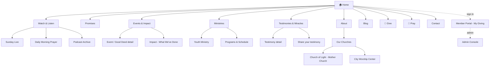
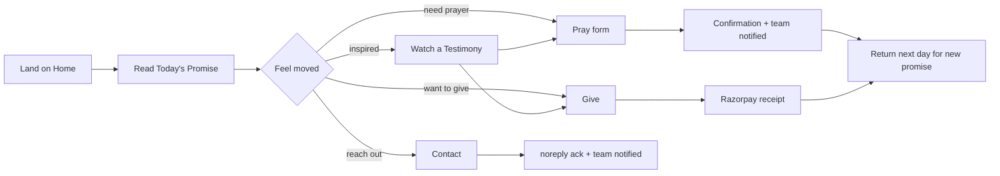
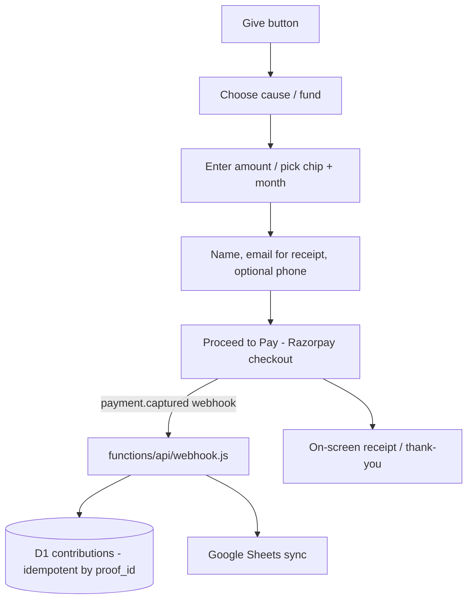
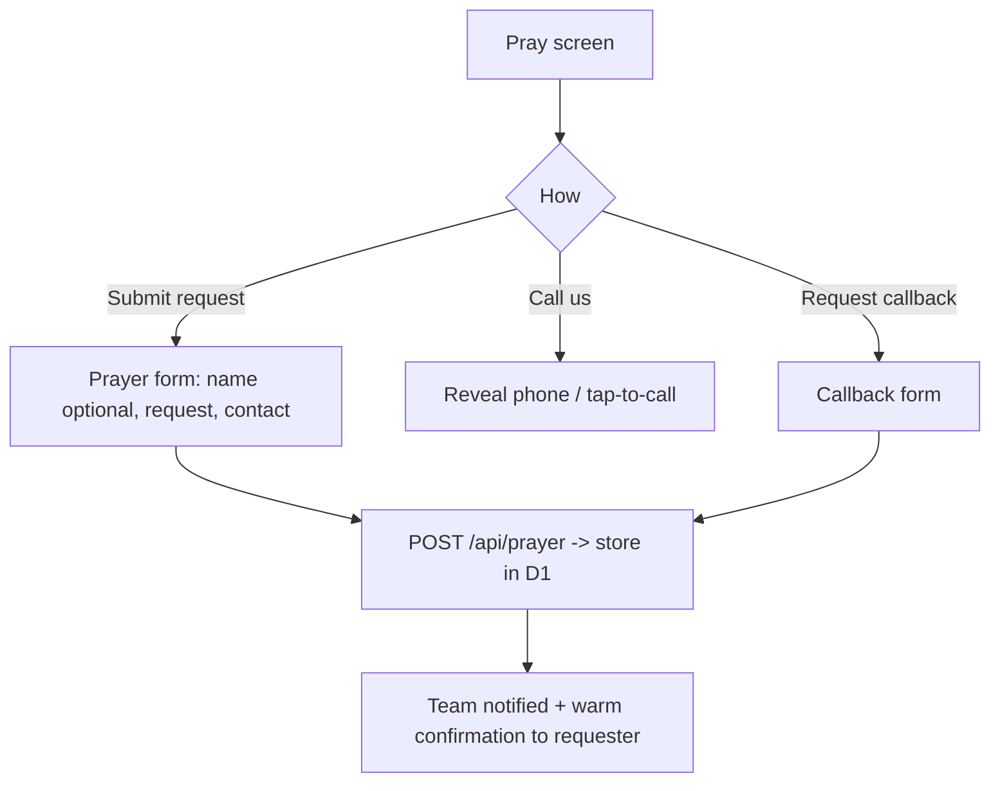
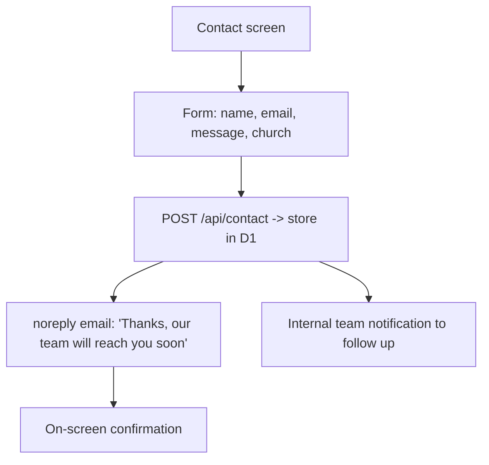
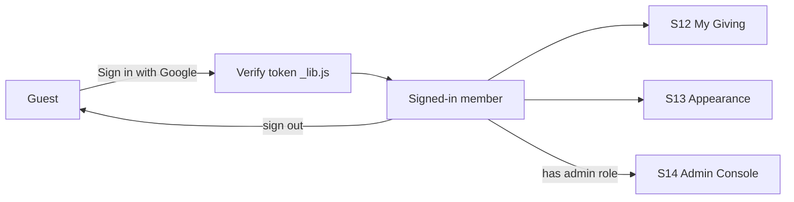
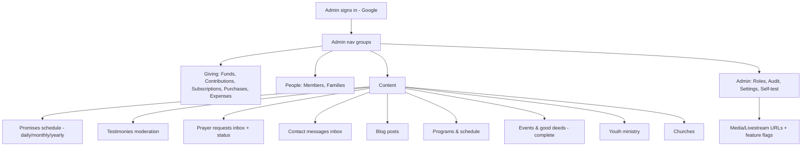

# 03 · App Flow

| | |
|---|---|
| **Product** | Light of Jesus Ministry — Worldwide Ministry App |
| **Milestone** | v2 — "Worldwide Ministry App" |
| **Document** | 3 of 6 (App Flow) |
| **Version** | 1.0 (Draft) |
| **Date** | 2026-07-16 |
| **Status** | Draft — awaiting approval |
| **Builds on** | [`01-PRD.md`](./01-PRD.md) · [`02-TRD.md`](./02-TRD.md) |
| **Next document** | [`04-uiux-design-spec.md`](./04-uiux-design-spec.md) — UI/UX Design & Spec |

> **Purpose.** Map **every screen** and the **navigation between them** — the exact
> paths a user takes across the app. Giving screens call the existing, **frozen**
> endpoints (TRD §4); the new experience ships behind a feature flag (TRD §5).

---

## 1. Information architecture (sitemap)

**Top-level primary nav (worldwide public site):**
`Home · About · Promises · Testimonies · Watch & Listen · Events · Ministries · Blog`
plus two always-visible action buttons **`Give`** and **`Pray`**, and **`Contact`**.
A **church switcher** and a **language toggle (EN / தமிழ்)** live in the header.

---

## 2. Global navigation shell (present on every screen)

| Region | Contents | Behavior |
|---|---|---|
| **Header** | Logo → Home · primary nav · **Give** & **Pray** buttons · **church switcher** · **language toggle** · auth (Sign in / avatar) | Sticky. On mobile, nav collapses into a hamburger drawer; **Give/Pray** stay visible. |
| **Church switcher** | *All · Church of Light · City Worship Center* | Filters church-scoped screens (Events, Programs, service times). Ministry-wide screens ignore it. Selection persists (localStorage). |
| **Language toggle** | EN / தமிழ் | Swaps UI labels (client dictionary) and shows `*_ta` content where available. Persists. |
| **Footer** | Quick links · churches & addresses · service times · socials (Instagram, YouTube) · daily morning prayer link · Give/Pray/Contact | Present site-wide. |
| **Auth state** | Signed-out → "Sign in with Google"; signed-in → avatar menu (My Giving, Appearance, Admin if permitted, Sign out) | Reuses existing Google Identity Services flow. |
| **Sticky mobile action bar** | Give · Pray · Contact | Always reachable on small screens. |

---

## 3. Screen inventory

Legend — **Type:** Public (P) / Member (M) / Admin (A). **Reuse** points to existing
code; **New** is built this milestone.

| ID | Screen | Type | Purpose / key elements | Source |
|---|---|---|---|---|
| **S1** | **Home** | P | Hero; **Today's / Monthly / Yearly Promise**; Give·Pray·Contact; live status + daily morning prayer link; latest testimony; next event/service; snapshot of the ministry | New (reuses verse foundation) |
| **S2** | About | P | Ministry story, vision, leadership; **Our Churches** section → Church of Light (mother) + City Worship Center (identity, location, times) | Extend `about.html` |
| **S3** | Promises | P | Today's promise in full + this month's + this year's; browse past promises; share; bilingual | New (`promises.js`, Bible data) |
| **S4** | Testimonies & Miracles | P | Grid of published testimonies/miracles; filter; **"Share your testimony"** CTA | New (`testimonies.js`) |
| **S4a** | Testimony detail | P | Full story + media; share; related | New |
| **S4b** | Share your testimony | P | Submit form → lands unpublished for moderation → thank-you | New |
| **S5** | Watch & Listen (Media hub) | P | Entry to Sunday Live, Daily Morning Prayer, Podcast archive | New (embeds; URLs from `config`) |
| **S5a** | Sunday Live | P | Embedded YouTube Live of Sunday prayer; falls back to latest recording when offline | New |
| **S5b** | Daily Morning Prayer | P | Live/again-link to the daily morning prayer stream | New |
| **S5c** | Podcast Archive | P | Playlist of past services/messages | New |
| **S6** | Events & Impact | P | Upcoming + past events, **good deeds & beneficiaries**, photo galleries; **church-filtered** | Extend events module + `impact.html` |
| **S6a** | Event / Good-deed detail | P | Full event, gallery, beneficiaries, "give to this cause" link | Extend `events.js` |
| **S7** | Ministries hub | P | Cards → Youth Ministry, Programs & Schedule | New |
| **S7a** | Youth Ministry | P | Youth programs, events, media | New |
| **S7b** | Programs & Schedule | P | Service times + recurring programs, **per church** | New (`programs.js`) |
| **S8** | Blog | P | Article list; categories; bilingual | New (`blog.js`) |
| **S8a** | Blog post | P | Article view; share; related | New |
| **S9** | **Give** | P | Choose cause/fund → amount → contribution modal → **Razorpay** → receipt. **Calls existing endpoints unchanged.** | **Reuse** `razorpay-checkout.js` + `webhook.js` (frozen) |
| **S10** | **Pray** | P | Prayer request form; **Request a callback**; **Call us**; contact-for-prayer → confirmation | New (`prayer.js`) |
| **S11** | Contact | P | Form (name/email/message/church) → **noreply ack + team notified**; address, map, phone, socials, per church | New (`contact.js`) |
| **S12** | Member Portal — My Giving | M | Signed-in member's contributions & receipts; link Google account | Reuse `member.html` / `member-dashboard.js` |
| **S13** | Appearance | M | Accent-theme prefs synced to account | Reuse `appearance.js` |
| **S14** | Admin Console | A | Manage everything (see §7) | Extend `admin.html` |
| **S0** | Preloader / 404 | P | Loading + not-found | Reuse `preloader.html` |

---

## 4. Primary visitor journeys

### 4.1 The "discover & be moved" flow (the core loop)

### 4.2 Giving flow (S9) — reuses the frozen path

> This flow's backend is **unchanged** from today. The new UI only restyles the entry
> point and calls the **same** checkout + webhook. See TRD §4.

### 4.3 Prayer flow (S10)

### 4.4 Contact flow (S11)

### 4.5 Auth / member states

Public screens need **no login**; sign-in unlocks the member portal and (if permitted)
the admin console. Reuses the existing Google-verified auth exactly.

---

## 5. Two-church segregation in navigation

- The **church switcher** (header) sets context: **All / Church of Light / City
  Worship Center**.
- **Church-scoped screens** react to it: Events (S6), Programs & Schedule (S7b),
  service times, and any church-attributed giving cause.
- **Ministry-wide screens** ignore it: Home promises, Testimonies, Blog, Media, About
  story, Give (general), Pray, Contact.
- The **About → Our Churches** section always shows **both** churches side by side with
  their identity, address, and service times, regardless of switcher state.
- Adding a future campus = a new `churches` row; it appears in the switcher
  automatically.

---

## 6. Home screen anatomy (S1 — the hub)

Top-to-bottom on load:
1. **Header** (nav, church switcher, language, Give/Pray, auth).
2. **Hero** — ministry identity + a rotating inspirational line; primary CTAs.
3. **Today's Promise** card (auto by date) → tap for full promise (S3).
4. **This Month's / This Year's Promise** compact cards.
5. **Live strip** — Sunday Live status (live/next) + **Daily Morning Prayer** link (S5).
6. **Latest Testimony** teaser → S4a; link to all (S4).
7. **What's happening** — next event/service (church-aware) → S6.
8. **Give · Pray · Contact** band.
9. **Footer**.

Every block deep-links to its full screen; nothing is a dead end.

---

## 7. Admin console flow (S14 — extends the existing console)

The current console groups (Overview · Giving · People · Content · Admin) gain new
**Content** items and complete the Events module — same login, roles, and audit:

- **Giving stays exactly as-is** — admins keep managing real contributions with no
  behavioral change.
- New content types follow the existing permission model (`manage_content`,
  `manage_events`) and write audit rows via `audit()`.
- **Feature flags** (Settings) control when the new public experience goes live.

---

## 8. Screen → endpoint map (ties to TRD §6)

| Screen | Reads | Writes |
|---|---|---|
| Home (S1) | `promises` (today/month/year), `testimonies`, `events`, `settings` (live URLs) | — |
| Promises (S3) | `promises` | — |
| Testimonies (S4/S4a) | `testimonies` | S4b → `POST /api/testimonies` (unpublished) |
| Media (S5) | `settings`/`config` (YouTube URLs) | — |
| Events & Impact (S6) | `events`, `purchases`, `expenses` | — |
| Ministries / Programs (S7) | `programs`, `events` | — |
| Blog (S8) | `blog` | — |
| **Give (S9)** | `funds`, `contributions` (read model) | **existing** Razorpay → `webhook.js` (frozen) |
| Pray (S10) | — | `POST /api/prayer` |
| Contact (S11) | `churches` | `POST /api/contact` (+ email) |
| Member (S12) | `auth`, `contributions`, `members` | `auth` link |
| Admin (S14) | all admin GETs | all admin mutations (permission-gated) |

---

## 9. Rollout note (nav-level)

During build, the **existing pages remain the live site**. The new Home and public
flow are reachable behind the `new_home_enabled` feature flag (TRD §5). When every
screen above is ready and approved, flipping the flag makes the new experience the
default — with a one-flag rollback that never touches contribution data. Every screen
that touches existing endpoints is covered by the regression net in
[`SAFETY-AND-TESTS.md`](./SAFETY-AND-TESTS.md), so a navigation/wiring change can't
silently break giving or data.

---

## 10. Next steps — document chain

App Flow complete. Proceed to **[`04-uiux-design-spec.md`](./04-uiux-design-spec.md)**
— define the look, color, feel, components, and design language for the screens mapped
here. **No implementation until all six documents are approved.** See
[`README.md`](./README.md) for the live tracker.
