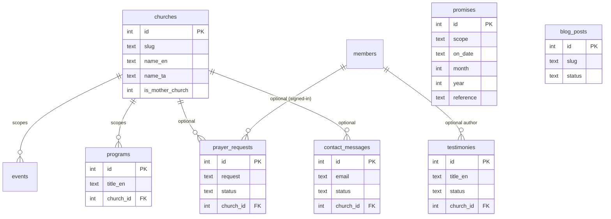

# 05 · Backend Schema

| | |
|---|---|
| **Product** | Light of Jesus Ministry — Worldwide Ministry App |
| **Milestone** | v2 — "Worldwide Ministry App" |
| **Document** | 5 of 6 (Backend Schema) |
| **Version** | 1.0 (Draft) |
| **Date** | 2026-07-16 |
| **Status** | Draft — awaiting approval |
| **Builds on** | [`02-TRD.md`](./02-TRD.md) · [`03-app-flow.md`](./03-app-flow.md) · [`SAFETY-AND-TESTS.md`](./SAFETY-AND-TESTS.md) |
| **Next document** | [`06-implementation-plan.md`](./06-implementation-plan.md) — Implementation Plan |

> **Purpose.** Define the **database tables, relationships, and API contracts** for
> the new ministry features. **Additive-only:** every table is new, created via new
> migrations (`0012+`) with `CREATE TABLE IF NOT EXISTS`. **No existing table
> (`contributions`, `members`, `funds`, `purchases`, `expenses`, `subscriptions`,
> `families`, `roles`, …) is altered, dropped, or retyped.** Conventions match
> `schema.sql`: snake_case, `INTEGER PRIMARY KEY AUTOINCREMENT`, `created_at DATETIME
> DEFAULT CURRENT_TIMESTAMP`, bilingual `*_en`/`*_ta` columns, nullable `church_id`.

---

## 1. Entity relationships



> All FKs are **nullable** (`church_id` null = ministry-wide). Existing tables keep
> their own relationships untouched; the new tables reference `churches(id)` and,
> optionally, `members(id)` — they are never referenced *by* existing tables.

---

## 2. New tables (migrations `0012+`)

### 2.1 `churches` — the two-church model (`0012_churches.sql`)
```sql
CREATE TABLE IF NOT EXISTS churches (
  id                INTEGER PRIMARY KEY AUTOINCREMENT,
  slug              TEXT UNIQUE NOT NULL,          -- 'church-of-light', 'city-worship-center'
  name_en           TEXT NOT NULL,
  name_ta           TEXT,
  is_mother_church  INTEGER DEFAULT 0,             -- 1 = Church of Light (mother)
  address_en        TEXT,
  address_ta        TEXT,
  city              TEXT,
  country           TEXT DEFAULT 'India',
  phone             TEXT,
  email             TEXT,
  map_url           TEXT,
  service_times_en  TEXT,                          -- freeform or JSON
  service_times_ta  TEXT,
  status            TEXT DEFAULT 'active',         -- 'active' | 'archived'
  sort_order        INTEGER DEFAULT 0,
  created_at        DATETIME DEFAULT CURRENT_TIMESTAMP,
  updated_at        DATETIME
);
-- Seed the two known churches (idempotent):
INSERT OR IGNORE INTO churches (slug, name_en, is_mother_church, sort_order)
  VALUES ('church-of-light', 'Church of Light', 1, 0);
INSERT OR IGNORE INTO churches (slug, name_en, is_mother_church, sort_order)
  VALUES ('city-worship-center', 'City Worship Center', 0, 1);
```

### 2.2 `promises` — daily / monthly / yearly promise words (`0013_promises.sql`)
```sql
CREATE TABLE IF NOT EXISTS promises (
  id           INTEGER PRIMARY KEY AUTOINCREMENT,
  scope        TEXT NOT NULL,          -- 'daily' | 'monthly' | 'yearly'
  on_date      TEXT,                   -- 'YYYY-MM-DD' when scope='daily'
  month        INTEGER,                -- 1..12 when scope='monthly'
  year         INTEGER,                -- e.g. 2026 (monthly/yearly)
  reference    TEXT,                   -- 'Isaiah 41:10'
  text_en      TEXT NOT NULL,
  text_ta      TEXT,
  reflection_en TEXT,
  reflection_ta TEXT,
  is_published INTEGER DEFAULT 1,
  created_by   TEXT,
  created_at   DATETIME DEFAULT CURRENT_TIMESTAMP,
  updated_at   DATETIME
);
CREATE INDEX IF NOT EXISTS idx_promises_daily   ON promises(scope, on_date);
CREATE INDEX IF NOT EXISTS idx_promises_month   ON promises(scope, year, month);
```
*Resolver:* "today" = the `daily` row for the current date (ministry TZ = IST), plus
the `monthly` row for (year, month) and the `yearly` row for the year; each falls back
to the most recent published row of that scope if none is assigned.

### 2.3 `testimonies` — testimonies & miracles (`0014_testimonies.sql`)
```sql
CREATE TABLE IF NOT EXISTS testimonies (
  id           INTEGER PRIMARY KEY AUTOINCREMENT,
  title_en     TEXT NOT NULL,
  title_ta     TEXT,
  body_en      TEXT NOT NULL,
  body_ta      TEXT,
  author_name  TEXT,                   -- display name (may differ from member)
  member_id    INTEGER,                -- optional link to members(id)
  place        TEXT,
  kind         TEXT DEFAULT 'testimony',   -- 'testimony' | 'miracle'
  media_url    TEXT,                   -- optional image/video (R2 or embed)
  church_id    INTEGER,                -- nullable = ministry-wide
  status       TEXT DEFAULT 'pending', -- 'pending' | 'published' | 'rejected'
  submitted_ip TEXT,
  created_at   DATETIME DEFAULT CURRENT_TIMESTAMP,
  published_at DATETIME,
  reviewed_by  TEXT
);
CREATE INDEX IF NOT EXISTS idx_testi_status ON testimonies(status, created_at DESC);
```
*Public submissions land `pending`; only `published` rows are shown publicly.*

### 2.4 `prayer_requests` (`0015_prayer_requests.sql`)
```sql
CREATE TABLE IF NOT EXISTS prayer_requests (
  id            INTEGER PRIMARY KEY AUTOINCREMENT,
  name          TEXT,                  -- optional
  email         TEXT,
  phone         TEXT,
  request       TEXT NOT NULL,
  wants_callback INTEGER DEFAULT 0,
  language      TEXT DEFAULT 'en',     -- 'en' | 'ta'
  church_id     INTEGER,               -- optional
  member_id     INTEGER,               -- optional (signed-in)
  status        TEXT DEFAULT 'new',    -- 'new' | 'praying' | 'contacted' | 'closed'
  is_private    INTEGER DEFAULT 1,     -- prayer requests are never public
  submitted_ip  TEXT,
  created_at    DATETIME DEFAULT CURRENT_TIMESTAMP,
  handled_by    TEXT,
  handled_at    DATETIME
);
CREATE INDEX IF NOT EXISTS idx_prayer_status ON prayer_requests(status, created_at DESC);
```

### 2.5 `contact_messages` (`0016_contact_messages.sql`)
```sql
CREATE TABLE IF NOT EXISTS contact_messages (
  id           INTEGER PRIMARY KEY AUTOINCREMENT,
  name         TEXT,
  email        TEXT NOT NULL,
  subject      TEXT,
  message      TEXT NOT NULL,
  church_id    INTEGER,               -- which church they're interested in
  language     TEXT DEFAULT 'en',
  status       TEXT DEFAULT 'new',    -- 'new' | 'acknowledged' | 'replied' | 'closed'
  ack_sent     INTEGER DEFAULT 0,     -- noreply acknowledgement dispatched?
  team_notified INTEGER DEFAULT 0,
  submitted_ip TEXT,
  created_at   DATETIME DEFAULT CURRENT_TIMESTAMP,
  handled_by   TEXT,
  handled_at   DATETIME
);
CREATE INDEX IF NOT EXISTS idx_contact_status ON contact_messages(status, created_at DESC);
```

### 2.6 `blog_posts` (`0017_blog.sql`)
```sql
CREATE TABLE IF NOT EXISTS blog_posts (
  id           INTEGER PRIMARY KEY AUTOINCREMENT,
  slug         TEXT UNIQUE NOT NULL,
  title_en     TEXT NOT NULL,
  title_ta     TEXT,
  body_en      TEXT NOT NULL,
  body_ta      TEXT,
  excerpt_en   TEXT,
  excerpt_ta   TEXT,
  category     TEXT,
  cover_url    TEXT,
  ministry_area TEXT,                 -- e.g. 'youth' (lets youth reuse blog)
  status       TEXT DEFAULT 'draft',  -- 'draft' | 'published'
  author       TEXT,
  created_at   DATETIME DEFAULT CURRENT_TIMESTAMP,
  published_at DATETIME,
  updated_at   DATETIME
);
CREATE INDEX IF NOT EXISTS idx_blog_status ON blog_posts(status, published_at DESC);
```

### 2.7 `programs` — service times & recurring programs (`0018_programs.sql`)
```sql
CREATE TABLE IF NOT EXISTS programs (
  id            INTEGER PRIMARY KEY AUTOINCREMENT,
  title_en      TEXT NOT NULL,
  title_ta      TEXT,
  description_en TEXT,
  description_ta TEXT,
  church_id     INTEGER,              -- nullable = ministry-wide
  ministry_area TEXT,                 -- e.g. 'youth'
  day_of_week   INTEGER,              -- 0=Sun..6=Sat, null = one-off/other
  start_time    TEXT,                 -- 'HH:MM'
  end_time      TEXT,
  recurrence    TEXT DEFAULT 'weekly',-- 'weekly' | 'monthly' | 'once'
  location      TEXT,
  status        TEXT DEFAULT 'active',
  sort_order    INTEGER DEFAULT 0,
  created_at    DATETIME DEFAULT CURRENT_TIMESTAMP,
  updated_at    DATETIME
);
CREATE INDEX IF NOT EXISTS idx_programs_church ON programs(church_id, day_of_week);
```

### 2.8 Events — extend, additively (`0019_events_church.sql`)
The events module already exists (`events` + `event_photos`). Add church scoping and
beneficiary info **without touching existing columns**:
```sql
ALTER TABLE events ADD COLUMN church_id INTEGER;              -- nullable
ALTER TABLE events ADD COLUMN beneficiaries_count INTEGER;    -- nullable
ALTER TABLE events ADD COLUMN good_deed_summary_en TEXT;      -- nullable
ALTER TABLE events ADD COLUMN good_deed_summary_ta TEXT;      -- nullable
```
> `ALTER TABLE … ADD COLUMN` with a nullable column is non-destructive and safe on the
> live DB. Confirm the exact current `events` columns before writing this migration.

### 2.9 Media & flags — reuse `config` (no new table)
Livestream/podcast URLs and feature flags live in the existing `config` key/value
table (read via `settings.js`), e.g.:
`new_home_enabled`, `sunday_live_url`, `daily_prayer_url`, `podcast_playlist_url`.

---

## 3. API contracts (new `functions/api/*` — all reuse `_lib.js` auth + `audit()`)

Common shape: public `GET` returns published rows only; admin mutations require the
listed permission via `requireAuth(context, '<perm>')`; every mutation writes an audit
row. Responses use the existing `json()` helper (`{ success, ... }`).

| Endpoint | Method | Auth | Request (key fields) | Response |
|---|---|---|---|---|
| `/api/promises` | GET | public | `?when=today` \| `?scope=daily&date=` | `{ success, today:{daily,monthly,yearly} }` or list |
| `/api/promises` | POST/PUT/DELETE | `manage_content` | promise fields | `{ success, id }` |
| `/api/testimonies` | GET | public | `?kind=&church=` | `{ success, testimonies:[…] }` (published) |
| `/api/testimonies` | POST | public (submit) | `title_en, body_en, author_name, …` | `{ success, id }` → status `pending` |
| `/api/testimonies` | PUT/DELETE | `manage_content` | `id, status:'published'…` | `{ success }` |
| `/api/prayer` | POST | public | `request, name?, email?, phone?, wants_callback?` | `{ success, id }` (+ email + team notify) |
| `/api/prayer` | GET/PUT | `manage_content` | list / `id,status` | `{ success, requests:[…] }` |
| `/api/contact` | POST | public | `name, email, subject, message, church?` | `{ success, id }` (+ noreply ack + team notify) |
| `/api/contact` | GET/PUT | `manage_content` | inbox / `id,status` | `{ success, messages:[…] }` |
| `/api/blog` | GET | public | `?slug=` \| list | `{ success, posts \| post }` (published) |
| `/api/blog` | POST/PUT/DELETE | `manage_content` | post fields | `{ success, slug }` |
| `/api/programs` | GET | public | `?church=` | `{ success, programs:[…] }` |
| `/api/programs` | POST/PUT/DELETE | `manage_content` | program fields | `{ success, id }` |
| `/api/churches` | GET | public | — | `{ success, churches:[…] }` |
| `/api/churches` | POST/PUT/DELETE | `manage_funds` | church fields | `{ success, id }` |
| `/api/events` *(extend)* | — | existing + `church_id` | existing + church filter | existing shape + new fields |
| `/api/settings` *(extend)* | GET/PUT | public GET / `manage_funds` PUT | media URLs + flags | `{ success, config }` |

**Email/notify** (Contact & Prayer) uses a shared helper (e.g. `functions/api/_mail.js`)
calling Resend over `fetch`; the request is **persisted first**, email second, so a
mail failure never loses data (TRD §3, §8).

---

## 4. Safety notes (from `SAFETY-AND-TESTS.md`)

- Each migration is **additive and idempotent**; run manually via the existing
  `apply-d1-migration.yml` / `deploy-migrations.yml` workflow, dry-run on a copy, with
  a backup first.
- After each new table ships, **add its critical columns to the `REQUIRED` map in
  `tests/regression/schema-contract.test.mjs`** so it becomes protected too.
- Each new endpoint ships with `tests/api/<name>.test.mjs` (happy path + permission
  gate + published-vs-draft visibility), keeping `npm test` green.

---

## 5. Next steps — document chain

Backend schema complete. Proceed to
**[`06-implementation-plan.md`](./06-implementation-plan.md)** — the phased build
order. **No implementation until all six documents are approved.** See
[`README.md`](./README.md) for the live tracker.
