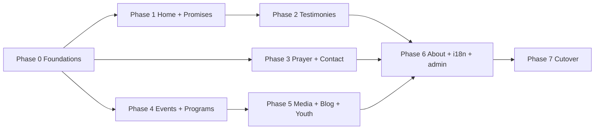

# 06 · Implementation Plan

| | |
|---|---|
| **Product** | Light of Jesus Ministry — Worldwide Ministry App |
| **Milestone** | v2 — "Worldwide Ministry App" |
| **Document** | 6 of 6 (Implementation Plan) |
| **Version** | 1.0 (Draft) |
| **Date** | 2026-07-16 |
| **Status** | Draft — awaiting approval |
| **Builds on** | Docs [01](./01-PRD.md)–[05](./05-backend-schema.md) + [`SAFETY-AND-TESTS.md`](./SAFETY-AND-TESTS.md) |

> **Purpose.** The **phased build order** — done **one phase at a time**, each phase
> shippable on its own, behind the feature flag, with **`npm test` green** before it
> merges. Nothing here changes the frozen giving path or existing data.

---

## Ground rules (every phase)
1. **Additive only** — new files, new tables (migrations `0012+`), nullable columns.
   No existing endpoint contract or column changes.
2. **Behind the flag** — new public UI is gated by `new_home_enabled` (and per-feature
   flags where useful). Existing pages stay live until cutover (Phase 7).
3. **Tests ship with the feature** — happy path + permission gate + visibility; extend
   `schema-contract.test.mjs` for each new table. Suite stays green (merge gate).
4. **Admin from day one** — each content type gets its admin management in the same
   phase, so the pastor/team can populate it.
5. **Bilingual** — English required, Tamil where content is provided (`*_en`/`*_ta`).
6. **One migration per phase**, applied manually (dry-run + backup) via the existing
   migration workflow.

---

## Phase 0 — Foundations & safety  ✅ *(started)*
**Goal:** groundwork that everything else stands on.
- ✅ **Regression test net** locking in existing behavior (82 tests) — *done*.
- `0012_churches.sql` + `/api/churches` + seed the two churches.
- **Feature-flag plumbing** in `settings.js`/`config` (`new_home_enabled`, etc.) and a
  tiny client helper to read flags.
- **i18n scaffold**: a client dictionary (JSON) + language toggle state in
  `localStorage`; a `t()` helper. No content yet — just the mechanism.
- **Email helper** `functions/api/_mail.js` (Resend via `fetch`) + team-notify address
  in config; unit-tested with a stubbed `fetch` (no network).
- **Media/flags config** keys registered.
**Tests:** `churches.test.mjs`, `_mail` helper test (stubbed), extend
`schema-contract.test.mjs` (`churches`). **Exit:** flags + churches live; suite green.

## Phase 1 — Home + Promises engine
**Goal:** the inspirational front door (PRD §7.1–7.2).
- `0013_promises.sql`, `/api/promises` (today-resolver + admin CRUD).
- New **Home** (behind flag): hero, Today/Monthly/Yearly promise cards (auto by date),
  Give·Pray·Contact, live strip + daily-prayer link, latest-testimony teaser slot.
- Admin: **Promises** scheduler in the console.
**Tests:** `promises.test.mjs` (today-resolver, fallback, permission), schema guard.
**Exit:** signed-out visitor sees today's promise on the flagged Home.

## Phase 2 — Testimonies & Miracles
**Goal:** PRD §7.3.
- `0014_testimonies.sql`, `/api/testimonies` (public list published, public submit →
  `pending`, admin moderate/publish).
- Screens S4/S4a/S4b; wire the Home teaser.
- Admin: **Testimonies** moderation queue.
**Tests:** submit lands pending; only published shown publicly; moderation gated.
**Exit:** a submitted testimony can be approved and appears publicly.

## Phase 3 — Prayer + Contact (with email)
**Goal:** PRD §7.5–7.6 — the cared-for response.
- `0015_prayer_requests.sql`, `0016_contact_messages.sql`; `/api/prayer`, `/api/contact`.
- On submit: **persist first**, then send **noreply acknowledgement** + **team
  notification** via `_mail.js`. Screens S10/S11 (+ call-us).
- Admin: **Prayer requests** inbox (status flow) + **Contact messages** inbox.
**Tests:** submission persists even if mail stubbed to fail; team-notify/ack flags set;
inboxes permission-gated.
**Exit:** a contact submission stores a row, sends the ack, and notifies the team.

## Phase 4 — Events, Impact, Programs & Schedule
**Goal:** PRD §7.7–7.8 — "what's happening / what we've done", per church.
- `0019_events_church.sql` (nullable church + beneficiary columns) — **complete** the
  events module and add it to the admin `NAV_GROUPS` (it's currently pending).
- `0018_programs.sql`, `/api/programs`; church switcher wired to Events + Programs.
- Impact reuses existing purchases/expenses read models.
- Admin: **Events** (completed) + **Programs**.
**Tests:** church filter works; existing events behavior unchanged; programs gated.
**Exit:** events/programs display and filter by church; impact shows transparently.

## Phase 5 — Watch & Listen, Blog, Youth Ministry
**Goal:** PRD §7.9–7.11.
- Media hub S5/S5a–c: YouTube Live embed + daily-prayer + playlist, URLs from config.
- `0017_blog.sql`, `/api/blog`; Blog screens S8/S8a.
- Youth Ministry hub reusing programs/events/blog scoped by `ministry_area='youth'`.
- Admin: **Blog**, **Media/Livestream** settings, youth tagging.
**Tests:** blog published-vs-draft visibility + permission; media URLs render safely.
**Exit:** Sunday live embeds; blog + youth sections populate.

## Phase 6 — About / Our Churches + language + admin polish
**Goal:** PRD §7.12–7.14 and full admin coverage.
- Extend `about.html` into About + **Our Churches** (both churches from `churches`).
- Finish the **language toggle** across all new content; verify Tamil layout.
- Ensure every new content type is fully manageable in the admin console.
**Tests:** language switch renders `*_ta`; about reads churches.
**Exit:** a first-time worldwide visitor can understand the ministry end-to-end.

## Phase 7 — Cutover & launch
**Goal:** make the new experience the default — safely.
- Full QA pass across devices, light/dark, every accent, EN/Tamil.
- Confirm **giving path untouched** (regression suite green; a real test payment in
  Razorpay test mode if available).
- **Flip `new_home_enabled`** → new Home becomes default; keep old pages reachable for
  a grace period.
- Monitor `activity_logs`; **rollback = flip the flag off** (data untouched).
**Exit:** new app is live worldwide; no regressions; contribution data intact.

---

## Sequencing & dependencies

Phases 1–5 can proceed largely in parallel after Phase 0, since each adds isolated
tables/endpoints/screens behind the flag. Phase 6 consolidates; Phase 7 launches.

## Definition of done (per phase)
- [ ] Feature works per PRD, behind the flag.
- [ ] New endpoint(s) + admin management shipped together.
- [ ] Migration is additive, idempotent, dry-run + backed up.
- [ ] `schema-contract.test.mjs` extended; new `tests/api/*` added; **`npm test` green**.
- [ ] No existing endpoint/column changed; existing pages still load.
- [ ] Pre-merge checklist in [`SAFETY-AND-TESTS.md`](./SAFETY-AND-TESTS.md) satisfied.

---

## Next steps
All six milestone documents are complete. On the owner's approval, begin **Phase 0
→ Phase 1**, one phase at a time, keeping the regression suite green throughout. See
[`README.md`](./README.md) for the live tracker.
