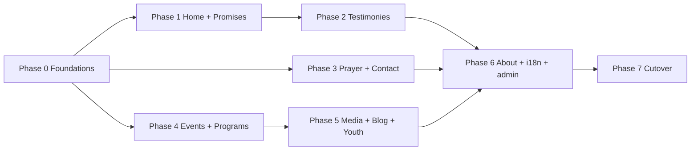

# 06 · Implementation Plan

| | |
|---|---|
| **Product** | Light of Jesus Ministry — Worldwide Ministry App |
| **Milestone** | v2 — "Worldwide Ministry App" |
| **Document** | 6 of 6 (Implementation Plan) |
| **Version** | 1.0 (Draft) |
| **Date** | 2026-07-16 |
| **Status** | Draft — awaiting approval |
| **Builds on** | Docs [01](./01-PRD.md)–[05](./05-backend-schema.md) + [`SAFETY-AND-TESTS.md`](./SAFETY-AND-TESTS.md) |

> **Purpose.** The **phased build order** — done **one phase at a time**, each phase
> shippable on its own, behind the feature flag, with **`npm test` green** before it
> merges. Nothing here changes the frozen giving path or existing data.

---

## Ground rules (every phase)
1. **Additive only** — new files, new tables (migrations `0012+`), nullable columns.
   No existing endpoint contract or column changes.
2. **Behind the flag** — new public UI is gated by `new_home_enabled` (and per-feature
   flags where useful). Existing pages stay live until cutover (Phase 7).
3. **Tests ship with the feature** — happy path + permission gate + visibility; extend
   `schema-contract.test.mjs` for each new table. Suite stays green (merge gate).
4. **Admin from day one** — each content type gets its admin management in the same
   phase, so the pastor/team can populate it.
5. **Bilingual** — English required, Tamil where content is provided (`*_en`/`*_ta`).
6. **One migration per phase**, applied manually (dry-run + backup) via the existing
   migration workflow.

---

## Phase 0 — Foundations & safety  🟡 *(backend done, frontend pending)*
**Goal:** groundwork that everything else stands on.
- ✅ **Regression test net** locking in existing behavior — now 407 tests (grew from
  the original 82 as this milestone's phases landed) — *done*.
- ✅ `0015_churches.sql` (renumbered from the doc's original `0012` — `0012`-`0014`
  were already taken by contribution-attribution/beta-access/webhook-backfill on
  `main`) + `/api/churches` + seed the two churches — `tests/api/churches.test.mjs`.
- ✅ **Email helper** `functions/api/_mail.js` (Resend via `fetch`, opt-in on
  `RESEND_API_KEY`) + `TEAM_NOTIFY_EMAIL`; unit-tested with a stubbed `fetch` (no
  network) — `tests/api/_mail.test.mjs`.
- ⬜ **Feature-flag plumbing** for the new public screens (`new_home_enabled` etc.) —
  not started; the existing `new_flow`/beta-cookie mechanism from
  `11-v2-flow-implementation.md` only gates the *existing-data* v2 port
  (Home/Our-Giving/Events/My-Giving/Give-Flow), not these new content types.
- ⬜ **i18n scaffold** (client dictionary + `t()` helper + `localStorage` toggle) —
  not started. Every new table already has bilingual `*_en`/`*_ta` columns ready
  for it (schema-level foundation is done; the client mechanism is not).
- ⬜ **Media/flags config keys** (`sunday_live_url`, `daily_prayer_url`,
  `podcast_playlist_url`) — not registered yet.
**Exit (partial):** churches + email helper live and tested; flag plumbing, i18n
scaffold, and media config keys remain.

## Phase 1 — Home + Promises engine  🟡 *(backend done, Home screen not built)*
**Goal:** the inspirational front door (PRD §7.1–7.2).
- ✅ `0016_promises.sql`, `/api/promises` (today-resolver + admin CRUD) —
  `tests/api/promises.test.mjs`.
- ⬜ New **Home** screen (hero, Today/Monthly/Yearly promise cards, Give·Pray·Contact,
  live strip, latest-testimony teaser) — not built.
- ⬜ Admin: **Promises** scheduler UI in `admin.html` — not built (API-only so far).
**Exit (partial):** the today-resolver works and is tested; nothing renders it yet.

## Phase 2 — Testimonies & Miracles  🟡 *(backend done, screens/admin UI not built)*
**Goal:** PRD §7.3.
- ✅ `0017_testimonies.sql`, `/api/testimonies` (public list published, public submit →
  `pending`, admin moderate/publish) — `tests/api/testimonies.test.mjs`.
- ⬜ Screens S4/S4a/S4b; Home teaser wiring — not built.
- ⬜ Admin: **Testimonies** moderation queue UI — not built.
**Exit (partial):** a submitted testimony can be approved via the API and is proven
to appear only in the published public read; there's no UI to submit/moderate yet.

## Phase 3 — Prayer + Contact (with email)  🟡 *(backend done, screens/admin UI not built)*
**Goal:** PRD §7.5–7.6 — the cared-for response.
- ✅ `0018_prayer_contact.sql` (`prayer_requests` + `contact_messages`); `/api/prayer`,
  `/api/contact` — persist-first-then-email, mutation-tested (see
  `docs/testing/COVERAGE-TRACKER.md`) — `tests/api/prayer.test.mjs`,
  `tests/api/contact.test.mjs`.
- ⬜ Screens S10/S11 (+ call-us) — not built.
- ⬜ Admin: **Prayer requests** inbox + **Contact messages** inbox UI — not built.
**Exit (partial):** a contact submission stores a row and (when `RESEND_API_KEY`/
`TEAM_NOTIFY_EMAIL` are configured) sends the ack + notifies the team — proven by
test, including surviving a simulated mail-provider outage. No inbox UI yet.

## Phase 4 — Events, Impact, Programs & Schedule  🟡 *(backend done, admin UI not built)*
**Goal:** PRD §7.7–7.8 — "what's happening / what we've done", per church.
- ✅ `0019_programs_and_event_church.sql` — nullable `church_id`/`beneficiaries_count`/
  `good_deed_summary_en`/`good_deed_summary_ta` added to the existing `events` table
  (additive `ALTER TABLE`, existing rows/behavior unaffected — proven by a
  default-to-null regression test), plus the new `programs` table.
- ✅ `/api/programs` (public `?church=` filter, admin CRUD) —
  `tests/api/programs.test.mjs`. `events.js`'s public listing gained the same
  `?church=` filter — `tests/api/events.test.mjs`.
- ⬜ Church switcher UI wired to Events + Programs — not built.
- ⬜ Admin: **Programs** panel (Events admin panel already exists) — not built.
**Exit (partial):** events/programs can be filtered by church via the API, proven by
test; no UI switcher yet.

## Phase 5 — Watch & Listen, Blog, Youth Ministry  🟡 *(blog backend done; media hub + youth UI not built)*
**Goal:** PRD §7.9–7.11.
- ⬜ Media hub S5/S5a–c (YouTube Live embed + daily-prayer + playlist) — not built;
  depends on Phase 0's media config keys, also not yet registered.
- ✅ `0020_blog.sql`, `/api/blog` (public published/`?slug=`/`?ministryArea=`, admin
  CRUD, slug-collision handling) — `tests/api/blog.test.mjs`.
- ⬜ Blog screens S8/S8a — not built.
- ⬜ Youth Ministry hub (reuses `programs`/`events`/`blog` via `ministry_area='youth'`
  — the data-model support exists; no dedicated screen yet).
- ⬜ Admin: **Blog**, **Media/Livestream** settings, youth tagging UI — not built.
**Exit (partial):** blog posts can be authored/published via the API with correct
draft/published visibility, proven by test; nothing public-facing renders them yet.

## Phase 6 — About / Our Churches + language + admin polish
**Goal:** PRD §7.12–7.14 and full admin coverage.
- Extend `about.html` into About + **Our Churches** (both churches from `churches`).
- Finish the **language toggle** across all new content; verify Tamil layout.
- Ensure every new content type is fully manageable in the admin console.
**Tests:** language switch renders `*_ta`; about reads churches.
**Exit:** a first-time worldwide visitor can understand the ministry end-to-end.

## Phase 7 — Cutover & launch
**Goal:** make the new experience the default — safely.
- Full QA pass across devices, light/dark, every accent, EN/Tamil.
- Confirm **giving path untouched** (regression suite green; a real test payment in
  Razorpay test mode if available).
- **Flip `new_home_enabled`** → new Home becomes default; keep old pages reachable for
  a grace period.
- Monitor `activity_logs`; **rollback = flip the flag off** (data untouched).
**Exit:** new app is live worldwide; no regressions; contribution data intact.

---

## Sequencing & dependencies

```mermaid
graph LR
    P0[Phase 0 Foundations] --> P1[Phase 1 Home + Promises]
    P0 --> P3[Phase 3 Prayer + Contact]
    P1 --> P2[Phase 2 Testimonies]
    P0 --> P4[Phase 4 Events + Programs]
    P4 --> P5[Phase 5 Media + Blog + Youth]
    P2 --> P6[Phase 6 About + i18n + admin]
    P3 --> P6
    P5 --> P6
    P6 --> P7[Phase 7 Cutover]
```
Phases 1–5 can proceed largely in parallel after Phase 0, since each adds isolated
tables/endpoints/screens behind the flag. Phase 6 consolidates; Phase 7 launches.

## Definition of done (per phase)
- [ ] Feature works per PRD, behind the flag.
- [ ] New endpoint(s) + admin management shipped together.
- [ ] Migration is additive, idempotent, dry-run + backed up.
- [ ] `schema-contract.test.mjs` extended; new `tests/api/*` added; **`npm test` green**.
- [ ] No existing endpoint/column changed; existing pages still load.
- [ ] Pre-merge checklist in [`SAFETY-AND-TESTS.md`](./SAFETY-AND-TESTS.md) satisfied.

---

## Next steps
All six milestone documents are complete. On the owner's approval, begin **Phase 0
→ Phase 1**, one phase at a time, keeping the regression suite green throughout. See
[`README.md`](./README.md) for the live tracker.
